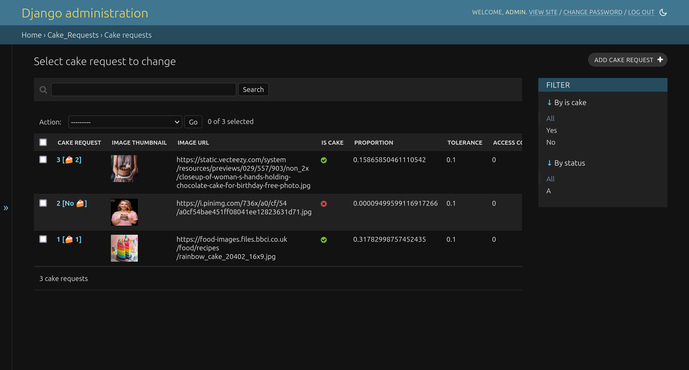

# Quickstart


## Prerequisites

- [Docker](https://docs.docker.com/get-docker/)
- [Docker Compose](https://docs.docker.com/compose/install/)

## Clone the repo

```bash
git clone git@github.com:garrywilliams/cake.git
cd cake
```

## API - Part 2

The second iteration of the API is built using Python and the Django framework. The API is deployed using Docker.

```bash
docker compose up -d
```

This should bring up the following services:

- cake
- gateway
- detector
- postgres
- redis
- celery
- flower

### View the API Docs and interact with the API

The API is available at [localhost:8000](http://localhost:8000/swagger) and the swagger docs allow you to interact with the API directly.

[OpenAPI/Swagger Docs](http://localhost:8000/swagger)

The following endpoints are available:

- GET /cakes
- GET /cakes/{id}
- POST /cakes
- DELETE /cakes/{id}

### Cake Requests

To view the Cake Requests that have been made to the API, visit the following URL:

[Django Admin](http://localhost:8000/admin)

username: `admin`
password: `password1`



This is a standard Django Admin interface and allows you to view the Cake requests which are a record of

- whether the image was recognised as a cake (If not then the Cake ID will be 0)
- whether the cake request was successful or not (is there a related Cake ID)

[Monitoring Celery with Flower](http://localhost:5555)


### Stop the API and other services

```bash
docker compose down
```
