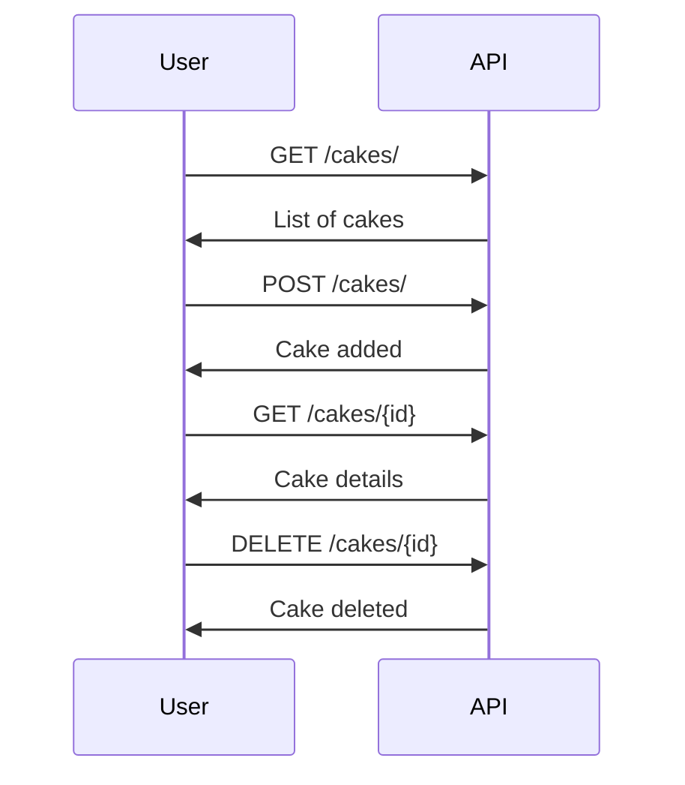

# Cake Bakery API: The Sweetest API on the Web!

 *Indulge in our delightful API that serves up the yummiest cakes!*

Welcome to the Cake Bakery API, a viral sensation in the world of digital bakeries! This API, crafted with love and a sprinkle of Python magic, allows you to interact with a virtual bakery's catalog of mouth-watering cakes. Whether you're looking to browse our extensive cake collection, add a new cake to our showcase, or even remove a cake from the menu, our API has got you covered.

## Features

- **Swagger/OpenAPI Spec**: Dive into our well-documented API with Swagger, making integration a piece of cake!
- **List All Cakes**: Browse our entire collection of cakes, each more tempting than the last.
- **Add a New Cake**: Got a new cake idea? Add it to our collection with ease.
- **Delete a Cake**: Too many cakes? Remove one from the list with a simple API call.
- **No Authentication Hassles**: We trust you! No need to worry about authentication tokens here.
- **Docker/Kubernetes Ready**: Deploy our API in a containerized environment with minimal setup.

## Data Model: Cake 🍰

Our API revolves around the `Cake` model, which includes:

- `id`: A unique identifier for each cake.
- `name`: The name of the cake (up to 30 characters).
- `comment`: A brief description or comment about the cake (up to 200 characters).
- `imageUrl`: A URL link to an image of the cake.
- `yumFactor`: A rating from 1 to 5 indicating how yummy the cake is.

### Example Cake JSON

```json
{
    "id": 1,
    "name": "Lemon cheesecake",
    "comment": "A cheesecake made of lemon",
    "imageUrl": "http://www.food.com/recipelemon-cheesecake-31004",
    "yumFactor": 3
}
```

## Getting Started

To get started with our Cake Bakery API:

1. Clone the repository: `git clone https://github.com/your-repo/cake-bakery-api.git`
2. Navigate into the project directory: `cd cake-bakery-api`
3. Deploy using Docker or Kubernetes as per the provided instructions.

## API Endpoints



- `GET /cakes/`: Retrieve a list of all cakes.
- `GET /cakes/{id}`: Retrieve a specific cake by ID. Returns a 404 error if the cake does not exist.
- `POST /cakes/`: Add a new cake to the collection.
- `DELETE /cakes/{id}`: Remove a cake from the collection.

## Deployment

This API is container-ready! You can deploy it using either Docker or Kubernetes.

## Contributing

Got a suggestion or a delicious new feature? Fork the repo, bake your changes into a new branch, and submit a pull request!

## License

This project is licensed under the MIT License - see the [LICENSE.md](LICENSE.md) file for details.

---

Indulge in our API, and let the sweet journey begin! 🎂✨

---

# Developer Guide

Welcome, developers! This section is dedicated to helping you get up and running with the Cake Bakery API, a FastAPI application. Below, you'll find detailed instructions on setting up your development environment, using the Makefile for various tasks, and deploying the application using Docker.

## FastAPI Framework

This application is built using FastAPI, a modern, fast (high-performance) web framework for building APIs with Python 3.7+ based on standard Python type hints. FastAPI is known for its high speed and ease of use, making it an excellent choice for building robust APIs.

## Setting Up Your Development Environment

To set up your development environment, follow these steps:

1. **Clone the Repository**: Start by cloning the repository to your local machine.
   ```bash
   git clone https://github.com/your-repo/cake-bakery-api.git
   cd cake-bakery-api
   ```

2. **Using the Makefile**: The included Makefile has several targets to simplify common development tasks.

   - **Creating a Virtual Environment**:
     ```bash
     make setup
     ```
     This command creates a virtual environment and installs all necessary dependencies.

   - **Running Tests**:
     ```bash
     make test
     ```
     Use this command to run the test suite with pytest.

   - **Running the Application Locally**:
     ```bash
     make run
     ```
     This starts the FastAPI server locally using Uvicorn.

   - **Linting the Code**:
     ```bash
     make lint
     ```
     This command lints the codebase using tools like isort, black, and flake8.

   - **Generating Coverage Reports**:
     ```bash
     make coverage
     ```
     Use this to generate a test coverage report.

   - **Cleaning Up**:
     ```bash
     make clean
     ```
     This command cleans up the project, removing the virtual environment and other artifacts.

## Deploying with Docker

The application is Docker-ready, allowing for easy deployment. Here’s how you can use Docker to deploy the application:

1. **Build the Docker Image**:
   ```bash
   docker build -t cake-bakery-api .
   ```
   This command builds a Docker image for the application, tagging it as `cake-bakery-api`.

2. **Run the Docker Container**:
   ```bash
   docker run -d -p 8000:8000 cake-bakery-api
   ```
   This starts a container from the image, mapping port 8000 of the container to port 8000 on your host machine.

3. **Accessing the Application**:
   Once the container is running, you can access the API at `http://localhost:8000`.

## Additional Notes

- **FastAPI Swagger UI**: FastAPI automatically generates and serves a Swagger UI for your API. Once your server is running, you can access it at `http://localhost:8000/docs`.

- **Hot Reloading**: For local development, running the application with `make run` enables hot reloading, allowing you to see changes in real-time without restarting the server.

- **Environment Variables**: Remember to set any necessary environment variables, especially when deploying in production.

---

We hope this guide helps you in developing and deploying the Cake Bakery API. Happy coding, and enjoy the sweet journey of building with FastAPI and Docker! 🍰✨