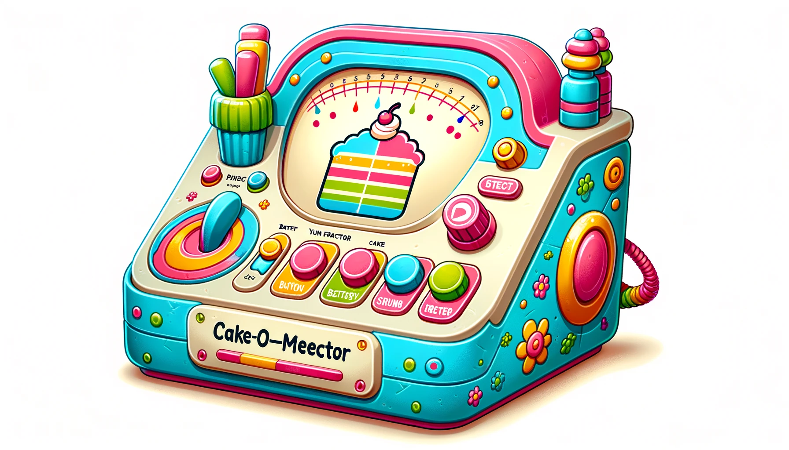

# Cake Image Detector API

## 🍰 Is It Cake? The API Edition 🍰

Welcome to the GitHub repository of the Cake Image Detector API, a delightful and quirky service inspired by the whimsical Netflix show "Is It Cake?". Just like the show, where contestants create astonishingly realistic cakes disguised as everyday objects, our API brings a slice of this fun to the digital world. 

### What's Cooking? 🎂

Our API is a light-hearted, yet powerful tool that uses machine learning to answer the burning question: "Is it a cake?" Simply feed it an image URL, and it will tell you if there's a cake hiding in that picture and what proportion of the image is actually cake. It's like having your own digital celebrity judge, minus the suspense and dramatic music!

### How to Use the API 🚀

1. **POST `/detect-cake/`**: Send us the URL of the image you're curious about. 
2. **Set the Threshold**: Adjust your confidence level from 0.0 (just a wild guess) to 1.0 (absolutely sure it's cake).
3. **Get the Response**: We'll tell you if it's a cake and how much of it is cake. 
4. Go to [documentation](http://localhost:8000/docs) or [documentation](http://localhost:8081/docs) for technical details on how to use the API.

### Why This API? 🤔

- **For Fun**: Because who doesn't love a good cake mystery?
- **For Science**: Experiment with machine learning in the most delicious way possible.
- **For Bakers and Makers**: Get inspired or check if your cake can fool our AI.

### Getting Started 🌟

Clone the repo, install the dependencies, and start playing the tastiest game of "Is it a cake?" with your images. Check out our detailed documentation for more on how to set things up.

The API is built with [FastAPI](https://fastapi.tiangolo.com/). We use [Docker](https://www.docker.com/) to containerize the app and [Docker Compose](https://docs.docker.com/compose/) to manage the services.

The food semantic segmentation model is based on the [Mobile Food Segmentation](https://www.kaggle.com/models/google/mobile-food-segmenter-v1) model from Kaggle. It was trained on the [Food-5K](https://mmspg.epfl.ch/downloads/food-image-datasets/) dataset and converted to TensorFlow Lite format. The model is hosted on [Kaggle](https://www.kaggle.com/models/google/mobile-food-segmenter-v1/frameworks/tfLite) and downloaded during the Docker build process [TODO].

https://www.kaggle.com/models/google/mobile-food-segmenter-v1/frameworks/tfLite

### Contribute 🤝

Got ideas on how to improve the API or want to add more features? Fork the repo, bake your changes into it, and send us a pull request. We love collaborations more than a baker loves their oven!

### License 📜

This project is licensed under the MIT License - see the [LICENSE](https://opensource.org/licenses/MIT) file for details.

### Contact 📧

Got questions, suggestions, or just want to share a picture of a cake (or is it)? Reach out to us at [contact@example.com](mailto:garry.p.williams@gmail.com).

### Final Slice 🍰

Whether you're a fan of the show, a tech enthusiast, or just here for some good old cake-or-not fun, we hope you enjoy using this API. Who knows, maybe it'll inspire you to bake a cake that can fool even the sharpest eyes - or algorithms!

---

*Inspired by the Netflix series "Is It Cake?" where the line between reality and cake gets deliciously blurred. Just like the show, our API is here to sprinkle a bit of joy and wonder into your day. Happy detecting!*

---

**Disclaimer**: This API is for entertainment purposes and might not always accurately identify cakes from other objects. Always double-check before taking a bite! 🕵️‍♂️🍰