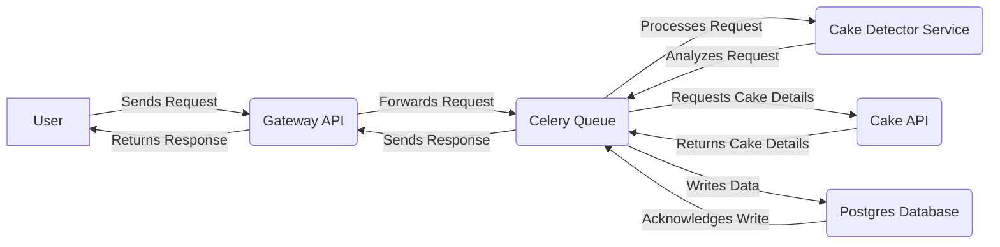
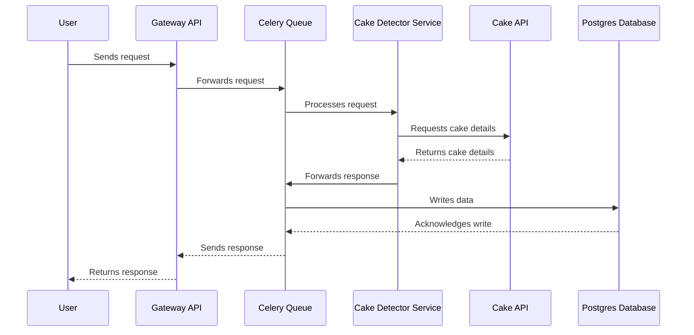

# Cake Bakery API with Django Gateway

## Overview

The Cake Bakery API, renowned for its simplicity and efficiency in handling cake-related data, has been enhanced with a Django gateway. This enhancement introduces advanced features like image validation, request monitoring, and detailed analytics, while maintaining the API's core functionalities.

### New Features

- **Django Gateway**: Adds an extra layer for handling requests, improving security and data processing.
- **Image Validation**: Utilizes an additional service to verify if submitted images represent cakes.
- **Request Monitoring and Analytics**: Tracks and analyzes each request and image view, providing valuable insights.
- **Celery with Redis**: Ensures efficient handling of asynchronous tasks and background operations.
- **Prometheus and Grafana Integration**: Offers advanced monitoring and visualization of API performance.
- **Enhanced Django Admin Interface**: Provides a robust platform for data analysis and management.

## User Guide

### Interacting with the API

- **Listing Cakes**: `GET api/cakes/` retrieves a list of all cakes, with detailed information including images and yum factors.
- **Adding a New Cake**: `POST api/cakes/` allows users to add a new cake. Images are validated to ensure they represent actual cakes.
- **Get a Cake**: `GET api/cakes/{id}` retrieves a specific cake by ID.
- **Deleting a Cake**: `DELETE api/cakes/{id}` removes a cake from the list. Each deletion is logged for record-keeping.

### Accessing Enhanced Features

- **Monitoring Dashboard**: Access real-time analytics and monitoring data through the Prometheus and Grafana dashboard.
- **Django Admin Portal**: Review detailed request logs, image views, and user interactions in the Django admin interface.

## Developer Guide

### System Architecture

The system is composed of several key components:

- **Django Gateway**: Serves as the primary interface for all API requests, adding a layer of processing and validation.
- **Celery with Redis**: Manages asynchronous tasks, enhancing performance and scalability.
- **Prometheus**: Provides output to tools for monitoring and visualizing system performance.

Overview of the system architecture:

Sequence diagram:

### Setting Up the Development Environment

1. **Clone the Repository**: `git clone [repository URL]`.
2. **Install Dependencies**: Navigate to the project directory and install required packages.
3. **Configure Environment Variables**: Set up necessary environment variables for Django, Celery, and Redis.

### Running the Application

- **Local Development**: Use Docker Compose to run the application locally, including all dependent services like Redis.
- **Testing**: Run automated tests to ensure functionality and stability.
- **Deployment**: Deploy the application using Docker or Kubernetes, ensuring all components are properly configured.

### Contributing to the Project

- **Fork and Clone**: Fork the repository and clone it for local development.
- **Feature Branch**: Create a new branch for each feature or fix.
- **Code Standards**: Follow PEP 8 guidelines and ensure code quality.
- **Pull Requests**: Submit pull requests for review and integration.

### Additional Resources

- **API Documentation**: Access detailed API documentation, including endpoint descriptions and usage examples.
- **Django Admin Guide**: Learn how to navigate and utilize the Django admin interface for data management and analysis.
- **Monitoring and Analytics**: Understand how to use Prometheus and Grafana for monitoring API performance and user interactions.

## License

This project is licensed under the MIT License. See the [LICENSE.md](LICENSE.md) file for details.
